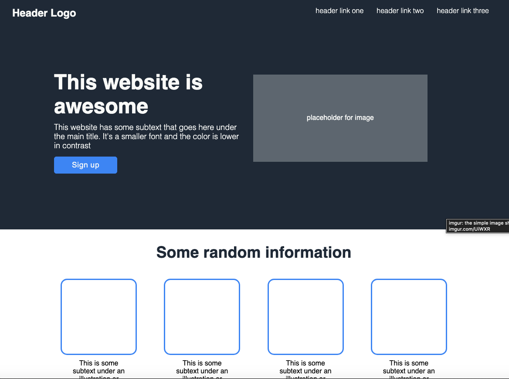
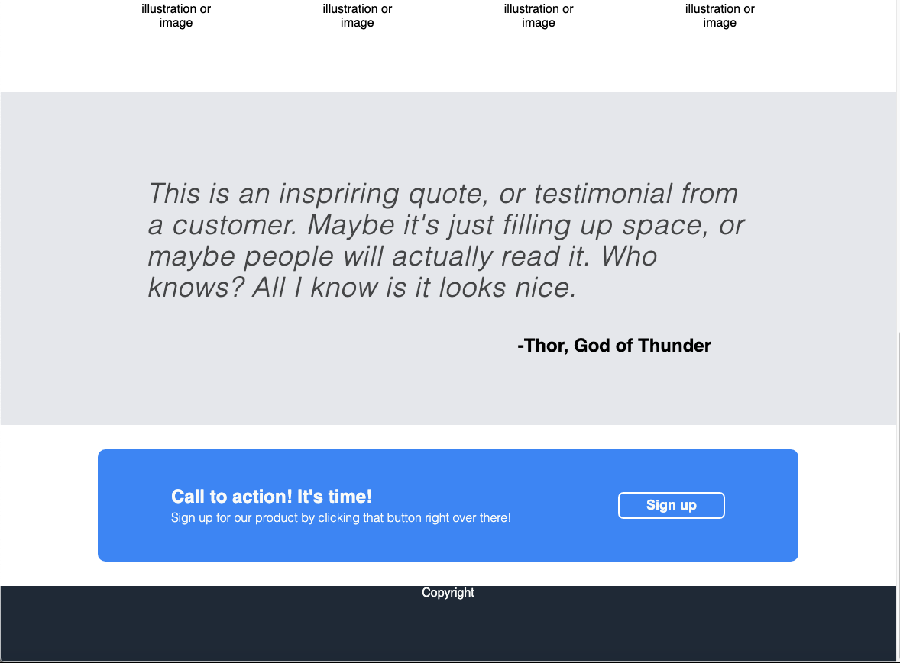

<h1>Odin Landing Page</h1>

<a href="https://www.theodinproject.com/lessons/foundations-landing-page">Project: Landing Page</a> from <a href="https://www.theodinproject.com/">The Odin Project Foundations Course</a>. The project was to create a web page from the provided designs. I used CSS custom properties and utility classes to efficiently apply styles to a single HTML file.

